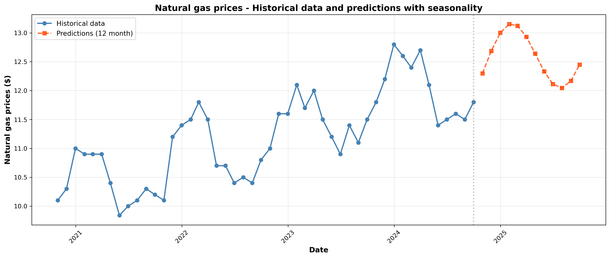
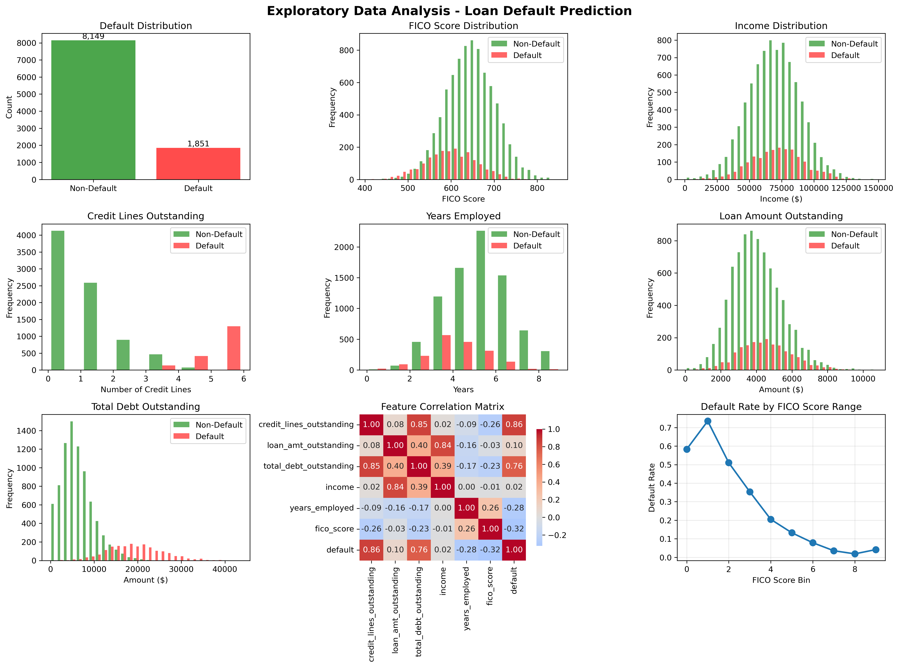
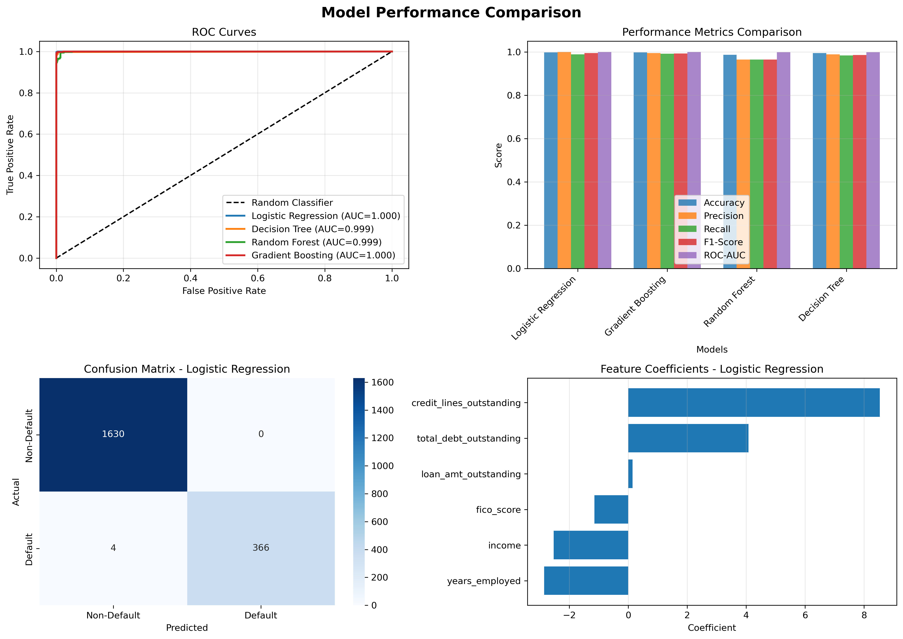

# 🏦 JPMorgan Chase & Co. — Quantitative Research Job Simulation
### The Forage | February 2026

<p align="center">
  
  
  
  
  
</p>

<!--
---

> 🇫🇷 **Version française** ci-dessous · 🇬🇧 **English version** below

---

## 🇫🇷 VERSION FRANÇAISE

### 📌 Présentation du projet

Ce projet a été réalisé dans le cadre de la **simulation professionnelle Quantitative Research de JPMorgan Chase & Co.** sur la plateforme The Forage. Il reproduit les missions réelles de l'équipe QR (Quantitative Research), spécialisée en modélisation financière, data analytics et gestion des risques.

**Durée estimée :** 6–7 heures | **Niveau :** Intermédiaire | **Langue du code :** Anglais

---

### 🗂️ Structure du projet

```
📁 JPMorgan-Forage-QR/
├── 📓 JpMorgan_Task1.ipynb         # Analyse & prédiction des prix du gaz naturel
├── 📓 JpMorgan_Task2.ipynb         # Valorisation d'un contrat de stockage
├── 📓 JpMorgan_Task3.ipynb         # Modèle de prédiction du risque de défaut
├── 📓 JpMorgan_Task4.ipynb         # Segmentation optimale des scores FICO
├── 📊 eda_analysis.png             # Analyse exploratoire des données (EDA)
├── 📊 model_comparison.png         # Comparaison des performances des modèles
├── 📊 natural_gas_predictions.png  # Prédictions des prix du gaz naturel
├── 📄 Nat_Gas.csv                  # Données historiques du gaz naturel (Task 1)
├── 📄 Nat_Gas2.csv                 # Données historiques du gaz naturel (Task 2)
└── 📄 Task_3_and_4_Loan_Data.csv   # Données de portefeuille de prêts
```

---

### ⚙️ Technologies utilisées

| Catégorie | Outils |
|-----------|--------|
| Langage | Python 3.9 |
| Analyse de données | pandas, NumPy |
| Machine Learning | scikit-learn |
| Modélisation statistique | scipy (interpolate, curve_fit, optimize) |
| Visualisation | matplotlib, seaborn |
| Environnement | Jupyter Notebook |

---

### 📋 Tâche 1 — Analyse et prédiction des prix du gaz naturel

**Objectif :** Construire une fonction capable d'estimer le prix du gaz naturel pour n'importe quelle date, passée ou future.

**Approche :**
- **Données :** 48 points mensuels (octobre 2020 – septembre 2024), prix moyen à **$11.21**
- **Interpolation cubique** pour les dates comprises dans la plage historique
- **Modèle saisonnier** pour l'extrapolation future : `Prix = Tendance + Amplitude × sin(2πt/365.25 + Phase) + Offset`

**Résultats clés :**

| Test | Date | Prix estimé |
|------|------|-------------|
| Interpolation | 2022-06-15 | **$10.55** |
| Validation (donnée réelle : $12.80) | 2023-12-31 | **$12.80** (erreur : $0.000) |
| Extrapolation hiver | 2025-01-31 | **$13.15** |
| Extrapolation été | 2025-06-30 | **$12.11** |

<p align="center">
  
</p>

---

### 📋 Tâche 2 — Valorisation d'un contrat de stockage de gaz naturel

**Objectif :** Créer un modèle de valorisation de contrats de stockage avec contraintes opérationnelles.

**Paramètres du modèle :**

| Paramètre | Description |
|-----------|-------------|
| `injection_dates` | Liste des dates d'injection (achat) |
| `withdrawal_dates` | Liste des dates de retrait (vente) |
| `injection_rate` | Débit max d'injection (MMBtu/jour) |
| `withdrawal_rate` | Débit max de retrait (MMBtu/jour) |
| `max_storage_volume` | Capacité max de stockage (MMBtu) |
| `storage_cost_per_day` | Coût de stockage par MMBtu par jour ($) |

**Logique de valorisation :**
```
Valeur du contrat = Revenus des retraits − Coûts d'injection − Frais de stockage
```

Le modèle optimise automatiquement les volumes injectés/retirés en respectant toutes les contraintes et calcule la valeur nette du contrat sur la période donnée.

---

### 📋 Tâche 3 — Modèle de prédiction du risque de crédit

**Objectif :** Prédire la probabilité de défaut (PD) des emprunteurs et calculer la perte attendue sur un portefeuille de prêts.

**Dataset :** 10 000 prêts | 6 variables explicatives | Taux de défaut : **18.51%**

**Variables utilisées :**
- `credit_lines_outstanding` — Nombre de lignes de crédit ouvertes
- `loan_amt_outstanding` — Montant du prêt en cours ($)
- `total_debt_outstanding` — Dette totale en cours ($)
- `income` — Revenu annuel ($)
- `years_employed` — Ancienneté professionnelle (années)
- `fico_score` — Score FICO

**Modèles comparés :**

| Modèle | Accuracy | Precision | Recall | F1-Score | ROC-AUC |
|--------|----------|-----------|--------|----------|---------|
| **Logistic Regression** ⭐ | **0.9980** | **1.0000** | **0.9892** | **0.9945** | **1.0000** |
| Gradient Boosting | 0.9975 | 0.9946 | 0.9838 | 0.9892 | 1.0000 |
| Random Forest | 0.9975 | 0.9946 | 0.9838 | 0.9892 | 0.9990 |
| Decision Tree | 0.9985 | 0.9973 | 0.9919 | 0.9946 | 0.9990 |

**Analyse de portefeuille (jeu de test — 2 000 prêts) :**
- Montant total en cours : **$8 373 362**
- Probabilité de défaut moyenne : **18.60%**
- Perte attendue totale : **$1 494 710.75**

<p align="center">
  
</p>

<p align="center">
  
</p>

---

### 📋 Tâche 4 — Segmentation optimale des scores FICO (Dynamic Programming)

**Objectif :** Convertir les scores FICO continus en catégories de notation discrètes en maximisant la log-vraisemblance binomiale, via la programmation dynamique.

**Méthodologie :**
1. Agrégation des données par score FICO unique (374 niveaux distincts)
2. Calcul de la log-vraisemblance binomiale par segment : `LL = k·log(p) + (n−k)·log(1−p)`
3. Optimisation par programmation dynamique pour trouver les 5 coupures optimales
4. Backtracking pour reconstruire les intervalles

**Table de notation FICO optimale :**

| Plage FICO | Note | Observations | Défauts | Probabilité de Défaut |
|------------|------|--------------|---------|----------------------|
| 408 – 520 | **E** | 301 | 199 | **66.11%** |
| 521 – 580 | **D** | 1 407 | 536 | **38.10%** |
| 581 – 640 | **C** | 3 438 | 703 | **20.45%** |
| 641 – 696 | **B** | 3 197 | 336 | **10.51%** |
| 697 – 850 | **A** | 1 657 | 77 | **4.65%** |

> 💡 La segmentation confirme la forte corrélation inverse entre score FICO et probabilité de défaut. Les emprunteurs en catégorie A (FICO ≥ 697) ont 14× moins de risque de défaut que ceux en catégorie E (FICO ≤ 520).

---

### 🧠 Compétences développées

- Interpolation et extrapolation de séries temporelles financières
- Modélisation saisonnière avec ajustement de courbe (`scipy.optimize.curve_fit`)
- Valorisation de dérivés financiers avec contraintes opérationnelles
- Analyse exploratoire de données (EDA) et feature engineering
- Comparaison et évaluation de modèles de classification (ML)
- Programmation dynamique appliquée à la segmentation de risque crédit
- Calcul de probabilité de défaut (PD) et de perte attendue (EL)

---

---
-->
## 🇬🇧 ENGLISH VERSION

### 📌 Project Overview

This project was completed as part of the **JPMorgan Chase & Co. Quantitative Research Job Simulation** on The Forage platform. It replicates real-world tasks performed by the QR (Quantitative Research) team, specialized in financial modeling, data analytics, and risk management.

**Estimated duration:** 6–7 hours | **Level:** Intermediate | **Code language:** English

---

### 🗂️ Project Structure

```
📁 JPMorgan-Forage-QR/
├── 📓 JpMorgan_Task1.ipynb         # Natural gas price analysis & prediction
├── 📓 JpMorgan_Task2.ipynb         # Commodity storage contract pricing
├── 📓 JpMorgan_Task3.ipynb         # Loan default prediction model
├── 📓 JpMorgan_Task4.ipynb         # Optimal FICO score bucketing
├── 📊 eda_analysis.png             # Exploratory Data Analysis
├── 📊 model_comparison.png         # Model performance comparison
├── 📊 natural_gas_predictions.png  # Natural gas price predictions
├── 📄 Nat_Gas.csv                  # Historical natural gas data (Task 1)
├── 📄 Nat_Gas2.csv                 # Historical natural gas data (Task 2)
└── 📄 Task_3_and_4_Loan_Data.csv   # Loan portfolio dataset
```

---

### ⚙️ Tech Stack

| Category | Tools |
|----------|-------|
| Language | Python 3.9 |
| Data Analysis | pandas, NumPy |
| Machine Learning | scikit-learn |
| Statistical Modeling | scipy (interpolate, curve_fit, optimize) |
| Visualization | matplotlib, seaborn |
| Environment | Jupyter Notebook |

---

### 📋 Task 1 — Natural Gas Price Analysis & Prediction

**Goal:** Build a function that estimates natural gas prices for any given date — past or future.

**Approach:**
- **Data:** 48 monthly data points (Oct 2020 – Sep 2024), average price **$11.21**
- **Cubic interpolation** for dates within the historical range
- **Seasonal model** for future extrapolation: `Price = Trend + Amplitude × sin(2πt/365.25 + Phase) + Offset`

**Key Results:**

| Test | Date | Estimated Price |
|------|------|-----------------|
| Interpolation | 2022-06-15 | **$10.55** |
| Validation (actual: $12.80) | 2023-12-31 | **$12.80** (error: $0.000) |
| Future extrapolation (winter) | 2025-01-31 | **$13.15** |
| Future extrapolation (summer) | 2025-06-30 | **$12.11** |

<p align="center">
  
</p>

---

### 📋 Task 2 — Commodity Storage Contract Pricing

**Goal:** Build a pricing model for natural gas storage contracts with operational constraints.

**Model Parameters:**

| Parameter | Description |
|-----------|-------------|
| `injection_dates` | List of injection (buy) dates |
| `withdrawal_dates` | List of withdrawal (sell) dates |
| `injection_rate` | Max daily injection rate (MMBtu/day) |
| `withdrawal_rate` | Max daily withdrawal rate (MMBtu/day) |
| `max_storage_volume` | Max storage capacity (MMBtu) |
| `storage_cost_per_day` | Storage cost per MMBtu per day ($) |

**Pricing Logic:**
```
Contract Value = Withdrawal Revenue − Injection Costs − Storage Fees
```

The model automatically optimizes injected/withdrawn volumes within all constraints and computes the net contract value over the given period.

---

### 📋 Task 3 — Loan Default Prediction Model

**Goal:** Predict the Probability of Default (PD) for borrowers and compute expected portfolio loss.

**Dataset:** 10,000 loans | 6 features | Default rate: **18.51%**

**Features used:**
- `credit_lines_outstanding` — Number of open credit lines
- `loan_amt_outstanding` — Outstanding loan amount ($)
- `total_debt_outstanding` — Total outstanding debt ($)
- `income` — Annual income ($)
- `years_employed` — Employment tenure (years)
- `fico_score` — FICO credit score

**Model Comparison:**

| Model | Accuracy | Precision | Recall | F1-Score | ROC-AUC |
|-------|----------|-----------|--------|----------|---------|
| **Logistic Regression** ⭐ | **0.9980** | **1.0000** | **0.9892** | **0.9945** | **1.0000** |
| Gradient Boosting | 0.9975 | 0.9946 | 0.9838 | 0.9892 | 1.0000 |
| Random Forest | 0.9975 | 0.9946 | 0.9838 | 0.9892 | 0.9990 |
| Decision Tree | 0.9985 | 0.9973 | 0.9919 | 0.9946 | 0.9990 |

**Portfolio Analysis (test set — 2,000 loans):**
- Total outstanding amount: **$8,373,362**
- Average probability of default: **18.60%**
- Total expected loss: **$1,494,710.75**

<p align="center">
  
</p>

<p align="center">
  
</p>

---

### 📋 Task 4 — Optimal FICO Score Bucketing (Dynamic Programming)

**Goal:** Convert continuous FICO scores into discrete rating categories by maximizing binomial log-likelihood using dynamic programming.

**Methodology:**
1. Aggregate data by unique FICO score (374 distinct levels)
2. Compute binomial log-likelihood per segment: `LL = k·log(p) + (n−k)·log(1−p)`
3. Dynamic programming to find the 5 optimal breakpoints
4. Backtracking to reconstruct optimal intervals

**Optimal FICO Rating Table:**

| FICO Range | Rating | Observations | Defaults | Probability of Default |
|------------|--------|--------------|----------|------------------------|
| 408 – 520 | **E** | 301 | 199 | **66.11%** |
| 521 – 580 | **D** | 1,407 | 536 | **38.10%** |
| 581 – 640 | **C** | 3,438 | 703 | **20.45%** |
| 641 – 696 | **B** | 3,197 | 336 | **10.51%** |
| 697 – 850 | **A** | 1,657 | 77 | **4.65%** |

> 💡 The segmentation confirms a strong inverse relationship between FICO score and default probability. Grade A borrowers (FICO ≥ 697) are 14× less likely to default than Grade E borrowers (FICO ≤ 520).

---

### 🧠 Skills Developed

- Time series interpolation and extrapolation for financial data
- Seasonal modeling with curve fitting (`scipy.optimize.curve_fit`)
- Financial derivative pricing with operational constraints
- Exploratory Data Analysis (EDA) and feature engineering
- ML model training, comparison and evaluation
- Dynamic programming for credit risk segmentation
- Probability of Default (PD) and Expected Loss (EL) computation

---

### 👤 Author

**Naomie Luendu** — Data Analyst  
📧 naomieluendu24@gmail.com  
🔗 [LinkedIn](https://linkedin.com/in/naomieluendu)  
💻 [GitHub](https://github.com/Naomie2406)

---

<p align="center">
  <i>Completed as part of the JPMorgan Chase & Co. Quantitative Research Job Simulation on The Forage — February 2026</i>
</p>
